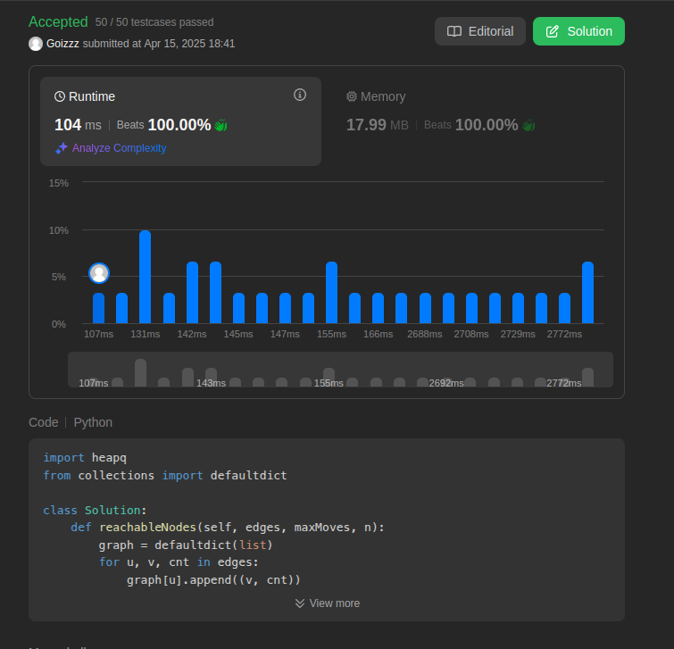
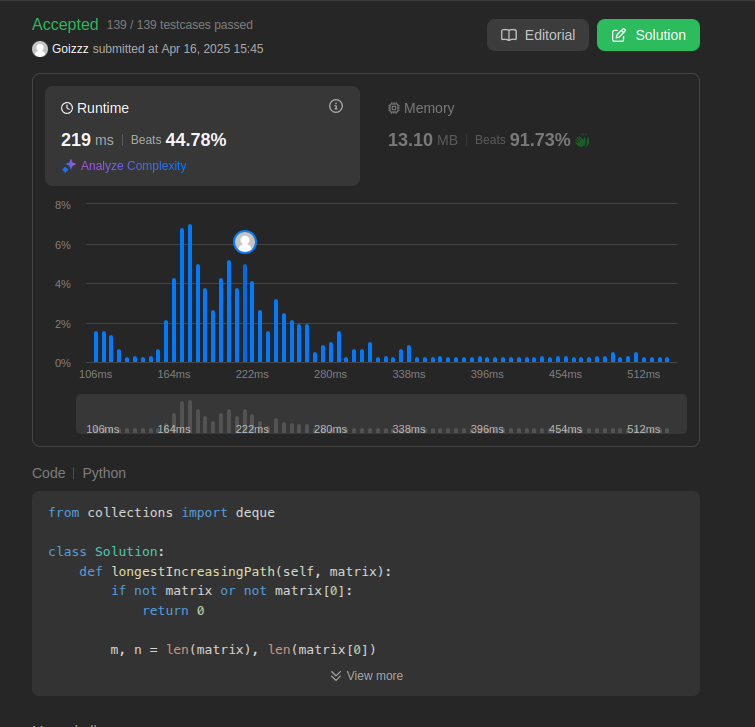
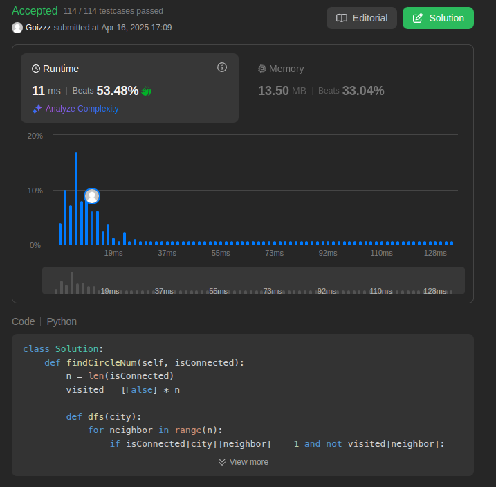
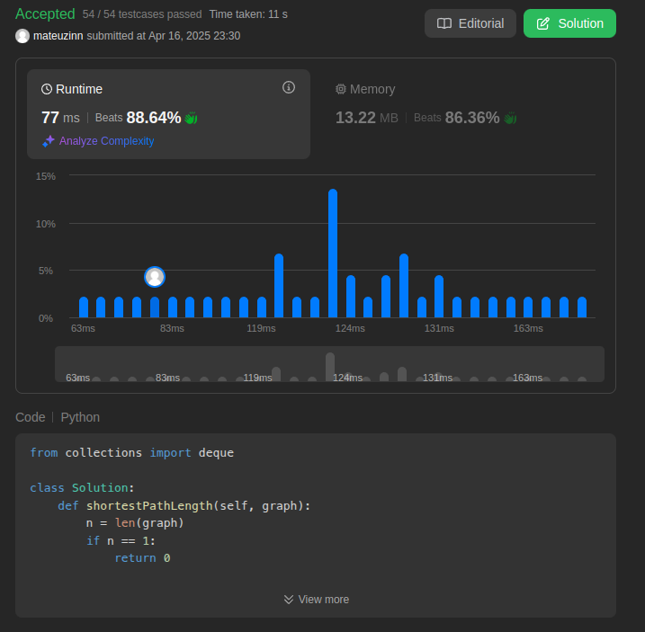
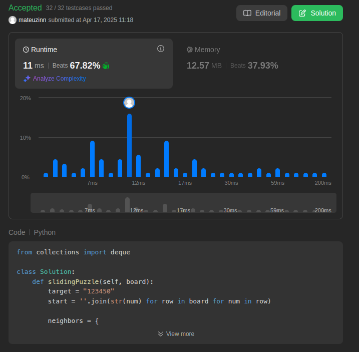

# Grafos1_leetcodePM

**Número da Lista**: 1 
**Conteúdo da Disciplina**: Grafos 

## Alunos
|Matrícula | Aluno |
| -- | -- |
| 22/2026386  |  Pedro Gois Marques Monteiro |
| 22/2025950  |  Mateus Henrique Queiroz Magalhães Sousa |

## Sobre 
Iremos responder questões sobre grafos no Leet code, cada membro da dupla fará duas questões difíceis e uma média.

# Screenshots Pedro

## Print 882

## Print 329

## Print 547

# Screenshots Mateus

## Print 847

## Print 773

## Instalação 
**Linguagem**: Python 

## Uso 
Teste

## Outros 

